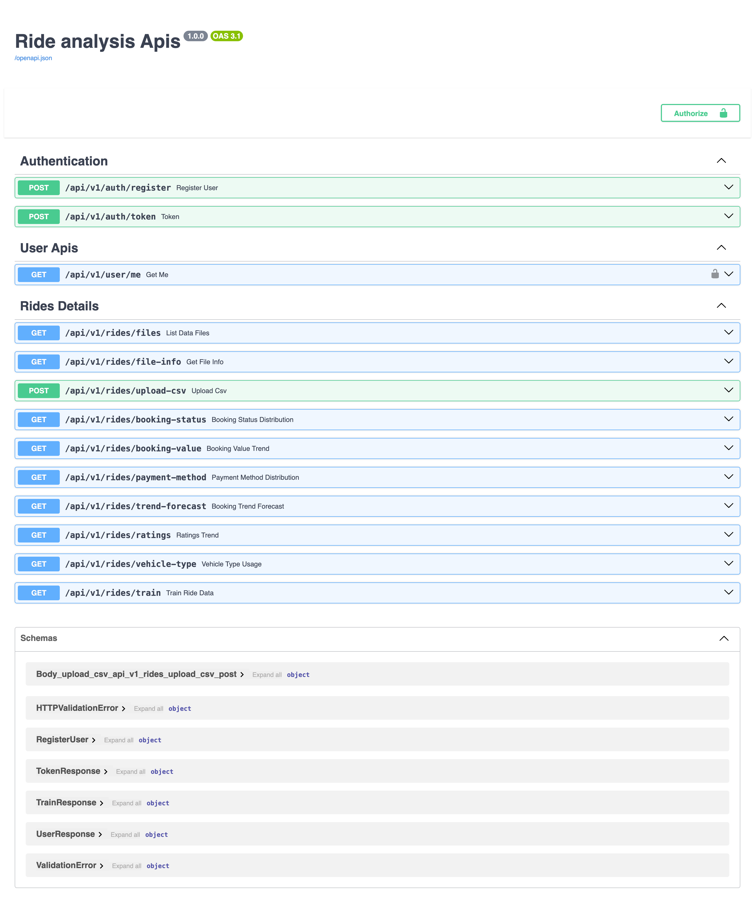
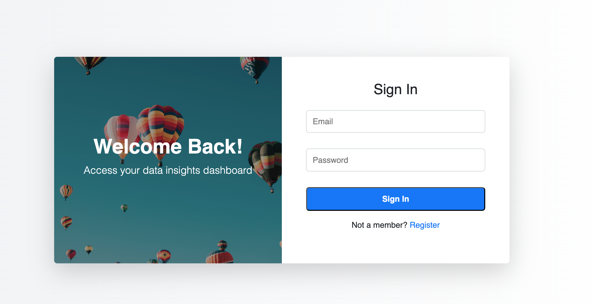
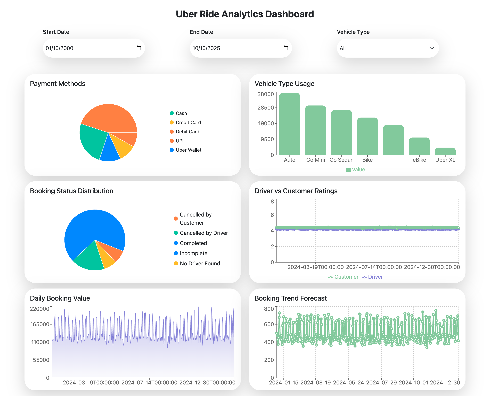

# 🚀 Data Insights Hub

A **Full-Stack Data Analytics Platform** built with **FastAPI**, **MongoDB**, and **React (Vite)** for secure CSV-based data analysis, visualization, and insights generation.

This project empowers users to **upload ride data**, **analyze it in real-time**, and **visualize insights interactively** — all within a modern, authenticated web experience.

---

## 🖼️ Screenshots

| Swagger API Docs | Login Page | Dashboard |
| :---------------: | :---------: | :---------: |
|  |  |  |

---

## ⚡ Overview

### 🔧 Backend (FastAPI + MongoDB)
- 🧩 **JWT Authentication** (Login & Signup)
- 📂 **CSV Upload & Parsing** using *Pandas & NumPy*
- 📊 **Dynamic Graph Generation** via *Matplotlib*
- ⚡ **Async MongoDB Operations** using *Motor*
- 🔐 **Secure Password Hashing** with *Bcrypt*
- 🌍 **Auto API Docs**: Swagger UI & ReDoc
- 🔧 Configurable with `.env`

### 💻 Frontend (React + Vite)
- 🧠 Built using **React 19 + Vite** for performance
- 🪶 **Responsive UI** powered by *Bootstrap 5* + *React Bootstrap*
- 🔒 **Protected Routes** using login state
- 📊 **Interactive Charts** with *Recharts*
- ⚙️ **Global State** handled via *Zustand*
- 🎉 **Toast Notifications** for user actions
- 🌈 Animated landing and dashboard pages with *Framer Motion*

---

## 🧩 Tech Stack

| Layer | Technologies |
|-------|---------------|
| **Frontend** | React 19, Vite, Bootstrap 5, React Router, Zustand, Axios, Recharts |
| **Backend** | FastAPI, Uvicorn, Motor (MongoDB), Pandas, NumPy, Matplotlib |
| **Authentication** | JWT (PyJWT), Bcrypt |
| **Database** | MongoDB |
| **Visualization** | Pandas + Matplotlib |
| **Dev Tools** | ESLint, dotenv, GitHub Actions-ready |

---

## ⚙️ Setup Guide

### 1️⃣ Clone the Repository
```bash
git clone https://github.com/your-username/data-insights-hub.git
cd data-insights-hub
````

---

### 2️⃣ Backend Setup (FastAPI)

#### ➤ Navigate to Backend Folder

```bash
cd backend
```

#### ➤ Create Virtual Environment

```bash
python -m venv venv
source venv/bin/activate      # Mac/Linux
venv\Scripts\activate         # Windows
```

#### ➤ Install Dependencies

```bash
pip install -r requirements.txt
```

#### ➤ Configure Environment Variables

Create a `.env` file inside the backend directory:

```bash
MONGO_URL=mongodb://localhost:27017/ridedata
JWT_SECRET=your_secret_key
JWT_ALGORITHM=HS256
```

#### ➤ Run the Server

```bash
uvicorn main:app --reload
```

#### ➤ Access API Docs

* Swagger UI → [http://localhost:8000/docs](http://localhost:8000/docs)
* ReDoc → [http://localhost:8000/redoc](http://localhost:8000/redoc)

---

### 3️⃣ Frontend Setup (React + Vite)

#### ➤ Navigate to Frontend Folder

```bash
cd ../frontend
```

#### ➤ Install Dependencies

```bash
npm install
```

#### ➤ Start Development Server

```bash
npm run dev
```

#### ➤ Access Frontend

👉 [http://localhost:5173](http://localhost:5173)

---

## 📊 CSV Analysis Workflow

1. **Login / Register** with JWT-secured authentication
2. **Upload your CSV** file (fields: `Date`, `Time`, `Pickup`, `Drop`, `Duration`, `Fare`)
3. **Backend Processing** using *Pandas*:

   * Rides count & duration statistics
   * Fare trend analysis
   * Graph generation with *Matplotlib*
4. **Frontend Visualization** with *Recharts* for dynamic charts

---

## 🌟 Folder Structure

```
data-insights-hub/
├── backend/                        # FastAPI backend
│   ├── app/
│   │   ├── routers/                # API route handlers
│   │   │   ├── auth.py
│   │   │   ├── users.py
│   │   │   └── analytics.py
│   │   ├── models/                 # Pydantic schemas & Mongo models
│   │   │   ├── users.py
│   │   │   └── schemas.py
│   │   ├── services/               # Business logic & database interactions
│   │   │   └── user_service.py
│   │   ├── utils/                  # Utility functions (JWT, security, etc.)
│   │   │   ├── auth.py
│   │   │   └── security.py
│   │   ├── database.py             # MongoDB connection setup
│   │   └── __init__.py
│   ├── data/                       # Default data and uploaded CSV files
│   │   └── dataset.csv
│   ├── main.py                     # FastAPI entry point
│   ├── requirements.txt
│   └── .env                        # Environment configuration
│
├── frontend/                       # React (Vite) frontend
│   ├── public/
│   │   └── vite.svg
│   ├── src/
│   │   ├── assets/
│   │   │   ├── css/
│   │   │   │   └── login.css
│   │   │   ├── login-box.jpg
│   │   │   └── react.svg
│   │   ├── components/             # Reusable UI components
│   │   │   ├── BookingStatusChart.jsx
│   │   │   ├── BookingValueChart.jsx
│   │   │   ├── PaymentMethodChart.jsx
│   │   │   ├── RatingsChart.jsx
│   │   │   ├── TrendForecastChart.jsx
│   │   │   └── VehicleTypeChart.jsx
│   │   ├── pages/                  # App pages (Login, Dashboard, Landing)
│   │   │   ├── Dashboard.jsx
│   │   │   ├── LandingPage.jsx
│   │   │   └── Login.jsx
│   │   ├── services/               # API calls and endpoints
│   │   │   ├── api.js
│   │   │   └── urls.js
│   │   ├── store/                  # Zustand global state management
│   │   │   └── authStore.js
│   │   ├── App.jsx
│   │   ├── main.jsx
│   │   ├── App.css
│   │   └── index.css
│   ├── package.json
│   ├── vite.config.js
│   └── eslint.config.js
│
├── notebooks/
│   └── exploration.ipynb           # Jupyter notebook for data exploration
│
├── screenshots/                    # Screenshots for documentation
│   ├── swagger.png
│   ├── login.png
│   └── dashboard.png
│
├── README.md
├── .gitignore
└── structure.txt
```

---

## 🧠 Future Enhancements

* 🤖 **AI-powered predictions** (ride trends, fare forecasting)
* 👥 **Role-based access control** (Admin / Analyst)
* 📄 **Export analytics** to PDF / Excel
* 🕒 **Live dashboard updates** with WebSockets

---

## 👨‍💻 Developer

**Bhupendra Sambare**
💼 Full Stack Developer — Java | Spring Boot | React | FastAPI
📧 [bhupendrasam1404@gmail.com](mailto:bhupendrasam1404@gmail.com)
🌐 [github.com/bhupendrasambare](https://github.com/bhupendrasambare)

---

## 🪄 Demo Landing Page

The landing page is built using **Bootstrap Carousel**, **Framer Motion**, and **React Router** for smooth navigation and dynamic transitions — offering a modern and responsive UI experience.

---

> 💡 *“Turning raw CSVs into actionable insights — fast, secure, and visual.”*
